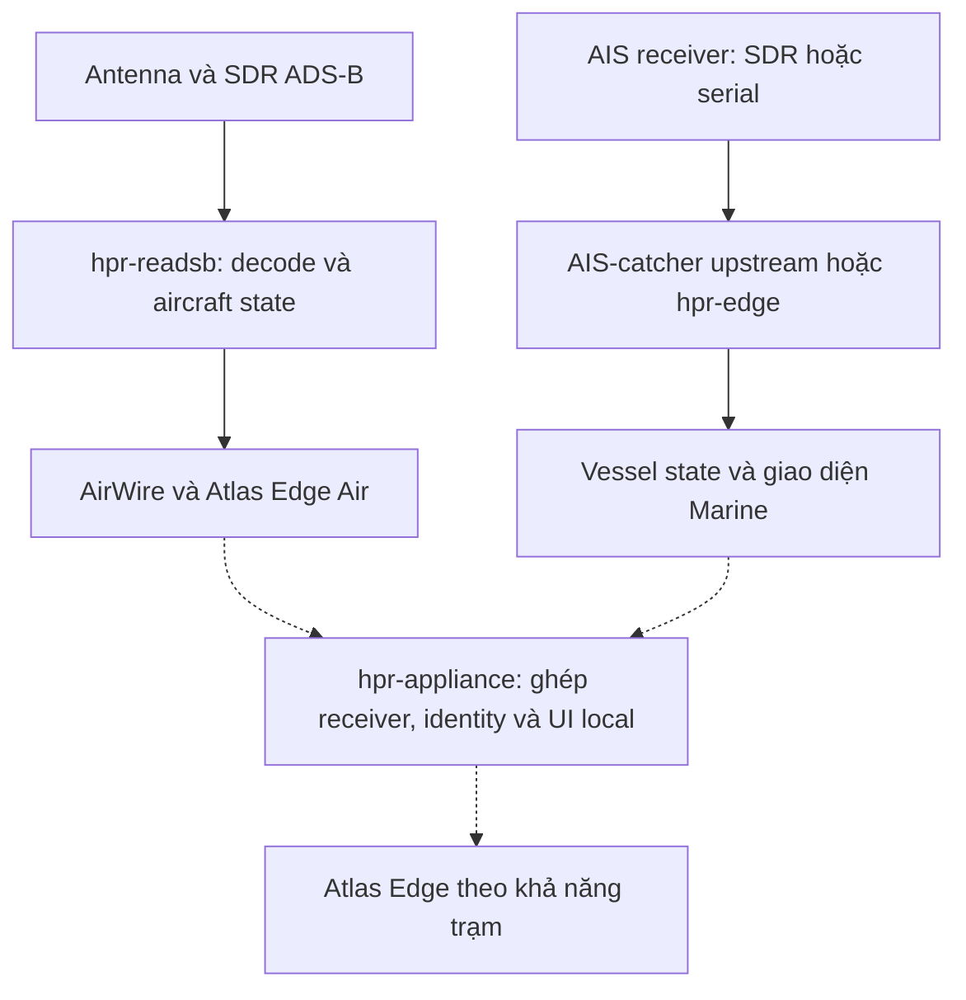
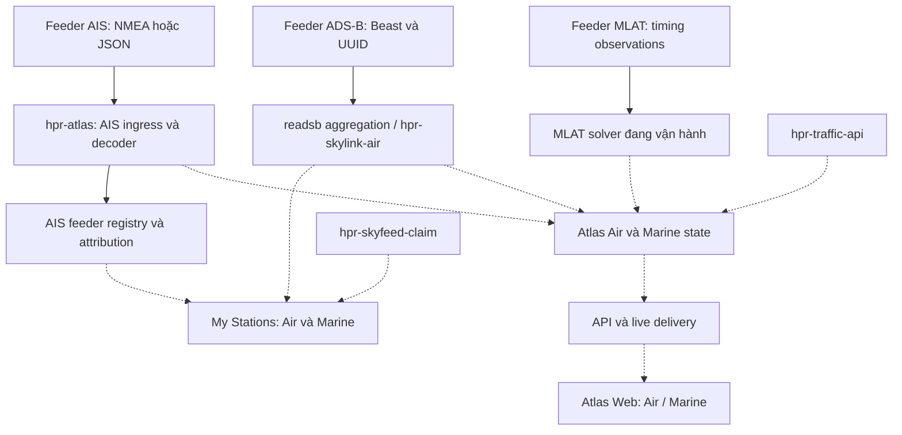
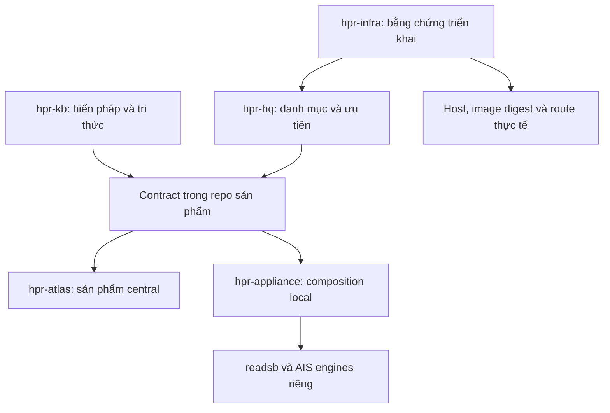
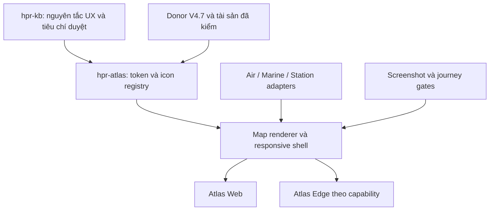

# Hiến pháp kiến trúc HPR

**Revision 0.2 — DRAFT, chờ Thanh phê duyệt qua PR.**

Đây là đầu mối SSOT (Single Source of Truth; “SST” trong hội thoại) cho phạm vi sản phẩm, ranh giới trách nhiệm và nguyên tắc kiến trúc HPR. Không phải báo cáo toàn bộ hệ thống đã triển khai.

Các điều khoản thiết kế dưới đây là **[Inference] đề xuất tổng hợp** từ yêu cầu trong phiên. Phần hiện trạng ghi rõ mức bằng chứng. Chỉ bản trên nhánh mặc định sau khi PR được duyệt mới có hiệu lực; bản tải về, bản tóm tắt và chat không tạo thêm nguồn chuẩn.

## 1. Intent — HPR làm gì

HPR xây mạng thu nhận và sử dụng dữ liệu quan sát, bắt đầu từ **Air + Marine**. Atlas là trải nghiệm sản phẩm; mạng feeder là một phần sản phẩm, không chỉ là nguồn đầu vào.

Ưu tiên hiện tại: một chủ trạm có thể đưa nguồn thu lên HPR, biết local đang thu gì, central đã nhận gì, quản lý trạm và quyền riêng tư bằng ngôn ngữ dễ hiểu.

Nghiên cứu RF rộng hơn nằm trong RF Portfolio. Remote ID, radiosonde, passive radar và các họ khác không tự trở thành backlog hoặc yêu cầu schema hôm nay.

## 2. SSOT và thẩm quyền

| Câu hỏi | Nguồn chuẩn |
|---|---|
| HPR có phạm vi và nguyên tắc kiến trúc nào? | Tài liệu này trong hpr-kb |
| Contract trường dữ liệu/API/wire chính xác là gì? | Contract có version và test trong repo sở hữu implementation; hiến pháp dẫn tới đó |
| Repo nào chịu trách nhiệm gì? | Ranh giới tại đây; danh mục đầy đủ trong hpr-hq |
| Hiện chạy image nào, trên host nào? | Bằng chứng triển khai có thời gian và digest từ hpr-infra |
| Việc nào được ưu tiên, ai làm? | hpr-hq và issue/PR của repo thực hiện |
| Nguồn RF mới có đáng đầu tư? | RF Portfolio trong hpr-kb; giữ nhãn nghiên cứu |

Một đầu mối kiến trúc không có nghĩa một file chứa mọi thông số hoặc một database chứa mọi dữ liệu. SSOT không thay thế code hay bằng chứng runtime.

Khi code khác thiết kế: ghi thành khoảng cách cần giải quyết. Không sửa báo cáo thực tế để trông như tuân thủ. Chat mới có quyết định khác phải được phản ánh vào PR trước khi các repo nhận chỉ dẫn trái nhau.

## 3. Kiến trúc đối chiếu tài sản hiện có

### 3.1 BR1 — antenna tới trải nghiệm local

Sơ đồ trách nhiệm theo tài liệu repo, **không phải xác nhận mọi đường nối đã chạy**. Đường liền là đường thành phần được mô tả/đọc; đường chấm là tích hợp mục tiêu.

- hpr-readsb đã có implementation và tài liệu AirWire/Edge; chưa chứng nhận toàn bộ wire/runtime parity trong đợt review này.
- hpr-edge là AIS serial node có sẵn; không đồng nhất với readsb Edge.
- hpr-appliance tự ghi trạng thái architecture/scaffold. Không coi là image production.
- hpr-ais-catcher được appliance nêu là kế hoạch; truy cập repo trong đợt kiểm tra trả 404. Không kết luận repo không tồn tại, cũng không ghi là donor đã sẵn sàng.

### 3.2 BR2 — feeders tới central và UI

Các đường vào Atlas chung là mục tiêu tích hợp. Cổng ingest MLAT nhận timing observations; vị trí đã giải là một đầu ra khác.

- ADS-B/MLAT hoạt động ổn là thông tin Thanh cung cấp; không phải runtime test mới.
- Đường AIS trong main đã đọc có registry IP và credit trước dedup.
- Registry UUID nằm trên nhánh riêng; relay TAG và server HPR1 chưa đồng bộ.
- My Stations thống nhất và mọi mũi tên chấm chưa được coi là end-to-end PASS.
- Enrichment không được chặn đường live. Lịch sử ghi bất đồng bộ theo chính sách lưu; chưa áp đặt database mới.

### 3.3 Quan hệ quản trị và sản phẩm

Đây là quan hệ trách nhiệm, không phải bảy service mới.

## 4. Bản đồ repo và mức bằng chứng

Ngày review: 2026-09-20. “Mã đã đọc” không đồng nghĩa đã build, đã deploy hay đạt tải.

| Repo / tài sản | Vai trò | Bằng chứng / giới hạn |
|---|---|---|
| hpr-atlas | Central ingest, state, API/live delivery, UI | main e039281; đã đọc AIS ingress, registry, decoder, binary hub |
| hpr-atlas / agent/feeder-uuid-claim | AIS UUID registry, migration, admin claim | 3952a7f; đã đọc implementation và tests; chưa chạy tests |
| hpr-readsb | Aviation receiver/state và local Air UI | README trên dev đã đọc; giữ RF/CPR core upstream |
| hpr-skylink-air | Đóng gói aviation central + attribution API | README đã đọc; composition runtime chưa kiểm thử |
| hpr-skyfeed-claim | Client hỗ trợ claim ADS-B | README đã đọc; chưa chứng nhận server ownership binding |
| hpr-edge | AIS serial node và Marine local UI | README đã đọc |
| hpr-marine | Marine UI, nguồn donor interaction/rendering | README hiện tại + scout trước; không coi là UI chuẩn thứ hai |
| hpr-appliance | Ghép nhiều receiver tại một site | abe8834; README xác nhận scaffold |
| hpr-traffic-api | Identity/catalog/route enrichment | README đã đọc; benchmark README không dùng làm kết quả HPR hiện tại |
| MLAT service | Solver chuyên dụng | Thanh báo đang vận hành; repo/image production chưa xác định trong review |
| AIS-catcher upstream | AIS reception/decoder donor | Thành phần upstream; không phải mã do HPR tự viết |
| hpr-ais-feed pilot | Relay station gắn TAG UUID | Source package local 0.1.0; chưa build image, chưa có repo chuẩn được chỉ định |
| hpr-hq | Portfolio, ưu tiên, repo inventory | README hiện tại |
| hpr-infra | Quan sát host/workload/routes/deployment | README hiện tại; chưa có scan production mới |
| hpr-kb | Tri thức và SSOT kiến trúc | Base ce45c298 |

Donor bổ sung từng được scout: airspace, aircraft-assets, streamgrid-runtime, hpradar-meteo. Chỉ dùng sau khi pin branch/commit, đọc license, kiểm thử phần lấy. Không chuyển nhãn “donor” thành “production” bằng tên repo.

## 5. Điều khoản kiến trúc

### A. UNIFY trải nghiệm, giữ domain

1. Air và Marine chung cách điều hướng, tài khoản, trạm, quyền và cách biểu đạt trạng thái.
2. Giữ readsb, AIS decoder và MLAT solver chuyên biệt. Không ghép decoder chỉ để có một core.
3. Core tối thiểu giữ identity, timestamp, provenance, validity và quyền truy cập. Trường chuyên ngành ở domain.
4. C0–C7 là bản đồ trách nhiệm tư duy, không bắt buộc tám service, tám database hoặc đủ tám bước.
5. Thêm domain có thể cần schema/contract mới khi ý nghĩa thực sự khác. Không ép vào generic key-value hay một struct chứa mọi trường.
6. Việc đổi C/Go, JSON/binary, framework hay database cần lý do kỹ thuật và số đo. Hiến pháp không khóa ngôn ngữ hoặc byte layout vĩnh viễn.

### B. Dữ liệu đúng nghĩa

1. Máy bay khác chuyến bay; tàu khác hành trình. AtoN không phải vessel chỉ vì cùng AIS.
2. MLAT là phương pháp tính vị trí của aircraft, không phải entity class mới.
3. UUID/ICAO24/MMSI có namespace và ý nghĩa riêng; non-ICAO phải giữ phân biệt.
4. Không biến missing thành zero; metadata mới không làm vị trí cũ thành live.
5. Giữ khác biệt observed/received/updated time; không có thời gian RF thì ghi unknown.
6. Ground speed, airspeed, course, heading, vertical rate và ROT không thay thế lẫn nhau.
7. Quality giữ đúng loại và đơn vị; không tạo điểm confidence chung không có định nghĩa.
8. Enrichment không ghi đè dữ liệu thu mà mất provenance.
9. “Hot” là cách vận chuyển/cập nhật, không phải nguồn gốc hoặc ý nghĩa dữ liệu.
10. Giữ nguồn gốc tới mức upstream thực sự cung cấp. Không tạo observation refs/receiver participation giả khi upstream không có.
11. Bảo toàn evidence không đồng nghĩa lưu mọi raw message vô hạn; retention có giới hạn, ngân sách và mục đích.

### C. Station, receiver và source

| Thuật ngữ nội bộ | Nghĩa | Tên hiển thị |
|---|---|---|
| site | Địa điểm lắp đặt | Địa điểm |
| station | Nhóm vận hành người dùng quản lý tại một địa điểm | Trạm của tôi |
| receiver | Bộ thu hoặc receiver instance logic | Bộ thu ADS-B / Bộ thu AIS |
| source | Đầu vào có nguồn gốc được biết; có thể là aggregate | Nguồn dữ liệu |
| connection | Phiên kết nối/UDP flow tạm thời | Kết nối |
| service | Tiến trình/container thực thi | Chỉ trong chẩn đoán |
| entity | Khái niệm nội bộ | Máy bay / tàu / báo hiệu hàng hải |
| provenance | Cách biết giá trị đó | Nguồn, phương pháp |
| ownership | Quyền quản lý được xác minh | Quyền quản lý trạm |

V1 không bắt buộc site và station thành hai bảng; có thể dùng một record cho một trạm tại một địa điểm. Receiver UUID hiện có tiếp tục định danh receiver; nhiều receiver được liên kết vào station. Trường lịch sử mang tên station_uuid phải có mapping rõ trước khi đổi nghĩa.

Nhận packet từ IP không chứng minh một trạm riêng. Aggregate không có attribution không được suy ra thành hàng nghìn receiver đã xác minh.

### D. Giao diện theo vai trò

| Vai trò | Tác vụ ưu tiên |
|---|---|
| Người xem | Tìm, chọn, theo dõi aircraft/vessel, xem tuổi và nguồn vị trí |
| Chủ trạm | Xem local thu được gì, HPR nhận gì, claim và privacy |
| Admin | Xử lý attribution, nguồn lỗi, quyền, xung đột và deployment |

V4.7 là baseline thị giác theo hướng gần đây của Thanh; donor runtime có thể khác. UI không hiển thị C0–C7, ontology, canonical fact hoặc fanout. Giữ thuật ngữ domain chính xác như MLAT, squawk, SOG, COG.

“Bộ thu hoạt động”, “đang gửi”, “HPR đã nhận” là ba trạng thái độc lập. Mỗi nhãn có nguồn bằng chứng; không lấy successful UDP write làm xác nhận central.

### D1. Design system là nền tảng sản phẩm

**[Inference] Điều khoản đề xuất:** UI architecture gồm design token, icon registry, map composition, responsive shell và interaction state. Các phần này có contract và chủ sở hữu như API; không để từng drawer hoặc donor tự định nghĩa một hệ thiết kế.

V4.7 là baseline thị giác, không phải bằng chứng mọi hành vi trong prototype đã đúng hoặc đã nối dữ liệu thật. V4.4 là donor interaction; V4.8.3 là donor rotorcraft theo hướng đã ghi trong phiên. Chỉ lấy từng phần phù hợp và pin commit trước khi tích hợp. Không thay visual baseline bằng toàn bộ giao diện donor.

Đề xuất đặt implementation chung trong hpr-atlas trước; không mở thêm repo, service hoặc bắt buộc framework mới. hpr-readsb, hpr-edge và appliance dùng bản build có version/digest phù hợp. Đồng bộ tài sản không đồng nghĩa copy rồi sửa riêng. Local Edge không phụ thuộc central để mở giao diện hoặc xem dữ liệu đang thu.

### D2. Design token: một nguồn, nhiều bề mặt

Ba tầng có trách nhiệm rõ:

| Tầng | Nội dung | Quy tắc |
|---|---|---|
| Primitive | Palette, spacing, font scale, radius, duration | Giá trị gốc; không gắn ý nghĩa domain |
| Semantic | Surface, text, focus, selected, live/aging/stale, air/marine | Component và map dùng ý nghĩa, không tự chọn màu |
| Component | Panel width, control size, sheet geometry, map label halo | Tham chiếu hai tầng trên; chỉ thêm khi có nhu cầu cụ thể |

**Bằng chứng đã đọc từ V4.7 tại 3faa1cd:** bảng dưới là giá trị trong prototype, không phải toàn bộ giá trị cuối cùng đã duyệt.

| Nhóm | Token/giá trị hiện có | Cách kế thừa |
|---|---|---|
| Spacing | s1–s6: 4, 8, 12, 16, 24, 32 px | Giữ nhịp cơ sở |
| Radius | r-sm/r/r-lg: 4/6/10 px | Panel và control có quy tắc nhất quán |
| Typography | fs-xs/sm/base/lg/xl: 11/12/13/15/20 px; Inter + system fallback | Kiểm tra khả năng đọc; không lấy chữ nhỏ ở prototype làm chuẩn bắt buộc |
| Desktop geometry | topbar 48, rail 66, list 280, panel 320 px | Baseline desktop; không ép lên mobile |
| Light | text #0f172a, accent #0369a1, air #9a5b00, sea #147a53 | Giữ hướng thị giác; kiểm tra contrast trên nền thực |
| Dark | text #f1f6ff, accent #00e5ff, air #f2cf5b, sea #4caf7d | Theme phải gồm cả map, icon, label và popup |
| Freshness | live/aging/stale có token riêng | Ngưỡng tuổi từ contract domain, không từ CSS |

Quy tắc implementation:

1. Một registry token sinh CSS variables và giá trị map style/renderer cần dùng; không duy trì hai bảng màu độc lập trong CSS và JavaScript.
2. Thay theme cập nhật shell, map, sprite tint, halo, trails và charts cùng lúc. Font hoặc tile ngoài lỗi vẫn có fallback sử dụng được.
3. Màu domain phân biệt Air/Marine; màu freshness nói tuổi dữ liệu; màu selection nói đối tượng đang chọn. Không dùng cùng một kênh màu để diễn đạt cả ba mà không có legend.
4. Trạng thái luôn có text, shape hoặc stroke hỗ trợ; không chỉ dựa màu. Focus ring không bị selected outline che.
5. Token bao phủ typography/line-height/tabular numbers, spacing, size, radius, border, elevation, z-order, motion và map label. Z-order có thứ tự được ghi, không tăng z-index tùy tiện.
6. Giá trị đặc thù hình học có thể ở component; ngoại lệ raw color/size phải có lý do. Không tạo token cho mọi số chỉ để đạt abstraction.
7. Token đổi nghĩa hoặc icon key bị xóa là thay đổi compatibility; consumer phải có migration. Không cập nhật Edge ngầm theo moving branch.

### D3. Icon system: phân biệt chức năng và đối tượng

| Họ icon | Ví dụ | Nguồn và trách nhiệm |
|---|---|---|
| Thao tác UI | Search, layers, settings, close, follow | Một bộ SVG được chọn, pin và kiểm license; cùng stroke, kích thước quang học và trạng thái |
| Đối tượng Air | Fixed-wing, rotorcraft, model khi biết | Artwork/manifest HPR đã kiểm; resolver theo dữ liệu aircraft |
| Đối tượng Marine | Vessel family, AtoN, base station | Resolver Marine; không vẽ AtoN như tàu đang di chuyển |
| Trạm/bộ thu | Station, ADS-B receiver, AIS receiver | Phân biệt địa điểm quản lý và thiết bị; capability badge riêng |
| Trạng thái | Selected, stale, alert, unknown | Vòng/halo/badge độc lập artwork; không tạo bản SVG cho mọi tổ hợp |

**Asset contract tối thiểu:** stable key, domain, category/model mapping, source + license/attribution, viewBox, kích thước quang học, anchor, hướng chuẩn, rotation policy, theme/tint policy và fallback. Rotorcraft thêm tên rotor groups nếu có animation. Manifest chỉ khai báo dữ liệu thực sự cần; sprite là sản phẩm build từ artwork chuẩn.

- Resolver Air: exact model đã xác minh → family → category → generic aircraft. Không dùng một model cụ thể khác làm fallback. MLAT không quyết định silhouette.
- Resolver Marine: loại đối tượng trước, ship type sau; thiếu loại dùng generic vessel. Unknown có biểu tượng rõ, không đoán.
- Map/list/detail dùng cùng key và cùng nghĩa; cho phép phiên bản đơn giản hóa theo kích thước. 3D/hero asset không bắt buộc tải vào bản đồ.
- Renderer không sở hữu artwork. Map sprite và inline SVG được sinh từ cùng nguồn; có mapping cho pixel ratio và anchor để không nhảy vị trí khi chọn.
- Body rotorcraft xoay cùng hướng đối tượng; animation rotor chỉ chạy trong group nội bộ. Tôn trọng reduced motion; không animate rotor cho hàng nghìn target mặc định.
- Hướng thân ưu tiên heading hợp lệ; course/track là fallback phải có policy domain. Thiếu hướng dùng biểu tượng không ngụ ý heading đã biết. Tính đúng với map bearing; không xoay hai lần.
- Kích thước vẽ khác hit area: icon có thể nhỏ nhưng control cảm ứng chính tối thiểu 44 × 44 CSS px theo chuẩn FE hiện có. Target map dày có hit tolerance và bộ chọn khi nhiều đối tượng trùng.
- Icon-only button có accessible name; không dùng tooltip làm cách duy nhất biết chức năng. Artwork trang trí không lặp nội dung cho screen reader.
- Asset license và quyền sửa/phân phối được kiểm theo từng nguồn; tên repo HPR không chứng minh mọi artwork là tài sản tự tạo.

Kích thước icon rotorcraft từng thử trong lịch sử là tuning donor, không tự thành chuẩn map chung. Cần duyệt contact sheet ở light/dark, normal/selected/stale và độ phân giải 1x/2x trước khi khóa size.

### D4. Map là workspace vận hành

| Lớp | Vai trò | Ràng buộc |
|---|---|---|
| Basemap | Địa lý và nhãn nền | Tách provider khỏi live data; giữ attribution theo nguồn |
| Context/environment | Weather, ports, airports, reference | Bật có mục đích; legend + tuổi riêng; không lấn target chính |
| Observations/entities | Máy bay, tàu, AtoN, trạm | Domain layer riêng trên cùng engine; độ mới và filter rõ |
| Relations | Trail, coverage, MLAT topology | Hiện theo tác vụ/selection; không bật toàn bộ graph mặc định |
| Selection | Halo, hướng, label ưu tiên | Cùng selected ID với list/detail; không mất khi refresh |
| Controls/surfaces | Search, legend, list, detail, sheets | Shell điều phối vùng map còn nhìn thấy |

MapLibre là engine đã có trong V4.7. Các donor deck.gl/3D/LOD chỉ bổ sung khi use case và benchmark chứng minh cần; không bắt buộc stack mới.

**Rendering và độ trung thực**

- Ưu tiên layer/sprite được batch cho tập target; không một DOM marker hoặc animation loop cho mỗi đối tượng ở quy mô lớn.
- LOD chuyển density/dot → symbol → chi tiết theo zoom và mật độ nhìn thấy. Ngưỡng phải đo trên thiết bị mục tiêu; không ghi số FPS hoặc target count chưa đo.
- Selected target giữ nổi bật qua declutter; label collision có thứ tự selected/focused trước. Số lượng tổng, số lọc và số trong viewport phải có nhãn đúng.
- Vị trí đo, vị trí nội suy/dự đoán và last-known phân biệt được. Interpolation không làm mới timestamp; mất feed không tiếp tục bay/chạy như dữ liệu live vô hạn.
- Với tàu, hull theo kích thước thật chỉ vẽ khi dimensions/reference point/hướng hợp lệ; thiếu dữ liệu dùng symbol, không dựng chiều dài giả.
- Đổi basemap/theme không mất entity sources, selection, filter hoặc follow state. Reconnect không nhân đôi layers/listeners.
- Tile/glyph/WebGL lỗi có thông báo đúng nguyên nhân. List/detail và trạng thái feed tiếp tục hoạt động trong khả năng dữ liệu còn có; bản đồ lỗi không được báo thành “không có mục tiêu”.
- Đường ra tile/weather provider là dependency riêng cần khai báo, gồm tác động privacy của request bên thứ ba. Không hứa offline map nếu chưa có nguồn tile/cache và quyền phân phối phù hợp.

**Camera và interaction**

- Camera dùng viewport padding từ panel/sheet thực tế, safe area và control lanes; selected target phải còn thấy.
- Follow là chế độ người dùng bật; drag map tạm dừng hoặc thoát với trạng thái rõ. Update dữ liệu không tự giật camera trở lại.
- Chọn từ map, list hoặc search đi qua cùng selection state. Đóng detail/đổi domain có policy rõ; resize không tự xóa selection.
- Tooltip chỉ là thông tin phụ; detail là nơi đọc bằng touch/keyboard. Có đường tìm/chọn đối tượng qua list cho người không dùng canvas.
- Legend giải thích symbol, freshness và lớp đang bật. Tuổi weather, tuổi vị trí và kết nối server không gộp thành một đèn “live”.

### D5. Responsive là thay đổi bố cục và hành vi

**Bằng chứng:** compositionMode của V4.7 dùng mobile <768, tablet <1280, desktop từ 1280 CSS px. Một số logic collection/selection vẫn dùng 1180, CSS còn ngưỡng cũ 700/930/1180. Đây là điểm cần đối chiếu, không mặc nhiên chứng nhận mọi khoảng đều đúng.

**[Inference] Contract mục tiêu:** dùng 768/1280 làm điểm bắt đầu kế thừa; một nơi định nghĩa mode cho CSS/JS. Điều chỉnh breakpoint phải dựa screenshot/journey, không thay rải rác. Chiều cao và input modality vẫn được xét riêng.

| Chế độ | Bố cục | Quyền sở hữu panel |
|---|---|---|
| Desktop ≥1280 | Rail + list trái, map giữa, detail phải khi đủ vùng sử dụng | List/detail cùng hiện được; tool thay thế vùng phụ liên quan, không chồng vô hạn |
| Tablet 768–1279 | Command dock, map, một collection/detail/tool panel chính | Mở detail thay list, giữ query/scroll để quay lại |
| Mobile <768 | Map-first, điều hướng gọn, contextual bottom sheet | Một sheet chính: list **hoặc** detail **hoặc** tool; menu tạm đóng khi chọn |
| Chiều cao thấp / landscape | Chrome gọn, panel cuộn nội bộ, map controls còn dùng được | Không để header/footer chiếm hết nội dung; có đường đóng/quay lại |

1. Dùng dynamic viewport và safe-area inset khi phù hợp; keyboard mở không che input/submit. Không khóa chiều cao theo 100vh một cách cứng nhắc.
2. Sheet có trạng thái đóng/peek/expanded rõ; drag có nút tương đương. Scroll sheet không vô tình pan map.
3. Resize/rotate giữ selected ID, filter, search và domain; chỉ thay composition. List position được khôi phục khi quay lại.
4. Escape/back đóng surface trên cùng theo quy tắc; focus trả về control mở nó. Modal mới trap focus; non-modal map panel không tự giam bàn phím.
5. Chuỗi dài, tên tàu tiếng Việt, identifier và units không làm vỡ layout. Có cách đọc giá trị bị ellipsis.
6. Capability quyết định điều hướng Edge: trạm chỉ Air không hiện tab Marine rỗng. Central Air/Marine và My Stations vẫn dùng chung pattern.
7. Drawer detail dùng template domain. Shared shell không ép squawk, SOG, COG, altitude vào bảng “universal properties” khó hiểu.

### D6. Feeder UX là hành trình thiết kế đầu tiên

| Bước | Người dùng cần biết/làm | Trạng thái phải tách |
|---|---|---|
| Onboard | Thêm bộ thu, chạy container, nhận diện trạm | Chưa cấu hình / đang chờ dữ liệu / lỗi cấu hình |
| Local overview | Bộ thu nào đang có dữ liệu | Process health khác packet freshness |
| Kết nối HPR | Đã gửi và central có xác nhận chưa | Sending / central received / chưa có xác nhận |
| Claim | Liên kết trạm vào tài khoản | Phát hiện UUID khác quyền quản lý đã xác minh |
| Privacy | Chọn thông tin công khai, xem trước | Owner view khác public view; không bật public bằng hành động claim |
| Vận hành | Xem lần nhận cuối, lỗi, hướng xử lý | Offline / stale / maintenance / unknown có bằng chứng |

Mỗi màn hình phải có loading, empty, error, stale, permission-denied và partial-data khi áp dụng. Không nhồi tất cả nhãn kỹ thuật lên overview; chẩn đoán mở dần. Owner thấy receiver health chi tiết theo quyền; public chỉ nhận DTO đã lọc. Không dùng dữ liệu mẫu để làm trạm có vẻ đang live.

### D7. Nơi triển khai và tiêu chí nghiệm thu

Các đường dẫn dưới đây là **đề xuất**, chưa tuyên bố đã tồn tại. Khi implementation bắt đầu, pin runtime branch và ghi đường dẫn thực thay cho đề xuất.

| Phần | Chủ sở hữu đề xuất | Deliverable |
|---|---|---|
| Token | hpr-atlas: ui/design/tokens.* | Registry + CSS/map outputs + theme preview |
| Icon | hpr-atlas: ui/design/icons/ | Manifest, resolver, sprite build, contact sheet, license inventory |
| Map | hpr-atlas: map module hiện hữu | Layer order, hit-test, LOD, camera padding, failure handling |
| Responsive shell | hpr-atlas: shell hiện hữu | Một mode policy, selection/panel state, domain slots |
| Consumer Edge | hpr-readsb / hpr-edge / appliance | Pinned build, capabilities, local-data adapter |
| Quality | Product repo + chuẩn frontend-quality-standard | Screenshot, journey evidence và exception record |

Không đổi wire/API chỉ để khớp prototype. Adapter map dữ liệu thật vào view model theo domain; thiếu dữ liệu phải hiển thị đúng.

**Gate trước khi công nhận UI hoàn thành:**

- Baseline screenshots gắn commit, viewport, theme, fixture và surface; review thay đổi có chủ đích. Không gọi screenshot prototype là production PASS.
- Ma trận đề xuất: 360×800, 390×844, 768×1024, 1024×768, 1280×800, 1440×900 và 844×390; kiểm thêm ngay hai phía breakpoint 768/1280. Chạy light/dark cho surface bị ảnh hưởng.
- Journey: search → select → detail → follow → trở về list; đổi domain; resize khi đang chọn; onboard → central received → claim → privacy preview.
- Map case: dense targets, overlapping targets, unknown type/heading, stale position, antimeridian khi phạm vi hỗ trợ cần; basemap/theme switch và tile/network failure.
- Accessibility: keyboard/focus, accessible names, 44px touch controls, reduced motion, phóng to text và contrast trên nền thực. Theo chuẩn FE HPR hiện có, lỗi Critical/High áp dụng chặn release.
- Performance ghi thiết bị/browser, số visible targets, update rate, thời gian tải, frame-time distribution và memory trong thời gian đo. Chốt budget sau baseline thực; không tuyên bố vượt đối thủ bằng cảm nhận.
- Kiểm regression theo phần thay đổi; không chạy lại toàn bộ mọi ma trận cho một sửa nội dung nhỏ.

**Trạng thái revision này:** đã đọc source V4.7 và chuẩn FE trong KB; mới bổ sung contract thiết kế. Chưa trích token thành package, chưa sửa renderer/shell, chưa render screenshot hoặc chạy browser journeys.

### E. Privacy và quyền

1. UUID là identifier, không phải password.
2. Public DTO được tạo bằng danh sách trường được phép; không serialize registry nội bộ.
3. IP, UUID đầy đủ, exact location và liên kết station–object không công khai mặc định.
4. Claim và consent công khai là hai quyết định riêng.
5. Public station dùng public_id độc lập. API chủ trạm kiểm tra ownership phía server.
6. Gỡ identity nội bộ khỏi public raw fanout; sửa UI đơn thuần không đủ.
7. UDP checksum không cung cấp xác thực hay bảo mật đường truyền. Ghi transport limitation; nâng lên đường mã hóa khi yêu cầu cần.
8. Log/retention có mục đích và thời hạn. Không đưa secret vào repo hoặc telemetry công khai.

Đây là chính sách thiết kế, không phải xác nhận privacy hiện tại đã đạt.

### F. Phát hành và vận hành

1. CI build/test image; station và production pull image theo SHA/digest. Station không là build server.
2. Runtime có giới hạn tài nguyên, log xoay vòng, state volume, restart policy và rollback.
3. Không dùng privileged, Docker socket hoặc mount host rộng cho relay. Device access chỉ cấp cho decoder cần thiết.
4. Reboot recovery cần thử thực tế, gồm Docker startup và identity persistence.
5. Phân biệt source review, unit test, integration, physical test, soak và production verification.
6. Không tuyên bố vượt đối thủ, FPS, CCU hoặc mức tiết kiệm nếu thiếu workload, máy đo, phương pháp và kết quả.
7. Pilot relay 0.1.0 đã giao là ngoại lệ chưa hoàn tất: source-build, chưa có image. Không làm mẫu onboarding lâu dài.

## 6. Bảng dữ liệu Air + Marine v1

Bảng phân loại phục vụ thiết kế; không buộc mọi domain có mọi trường.

| Nhóm | Air | Marine | Nguồn / cách xử lý |
|---|---|---|---|
| Identity | ICAO24/non-ICAO, callsign | MMSI, callsign, ship name, IMO khi có | Giữ transmitted và registry riêng |
| Classification | Emitter category; type từ registry | Ship type; AtoN/base theo loại đối tượng | Không gộp category với protocol |
| Position | ADS-B decoded hoặc MLAT solved | AIS lat/lon | Source method + tuổi vị trí |
| Altitude | Barometric/geometric, reference rõ | Không áp dụng cho vessel thông thường | Domain-specific |
| Speed | GS riêng IAS/TAS | SOG | Đơn vị và loại tốc độ rõ |
| Direction | Track; true/magnetic heading | COG; true heading | Không đồng nhất course và heading |
| Rates | Vertical rate; track rate nếu có | ROT | Các trường độc lập |
| Status | Squawk, emergency, air/ground | Navigation status | Theo field và validity |
| Declaration | Intent nếu nguồn cung cấp | Destination/ETA/draught | Không coi là hành trình đã xác minh |
| Reception quality | RSSI và số liệu receiver | RSSI/channel khi có | Metadata thu |
| Position quality | NIC/NAC/SIL hoặc solver quality | Accuracy flag và thông tin liên quan | Không trộn với RSSI |
| Receiver/source | UUID hoặc upstream source đã biết | UUID hoặc legacy/aggregate | Attribution riêng với ownership |
| Runtime age | Last received và last position update | Tương tự | Tính từ timestamp có nghĩa rõ |
| Enrichment | Registration/model/operator/photo | Registry/builder/operator/photo | Cache, không chặn live |
| Context | Route/schedule/weather | Port/voyage/weather | Phân biệt khai báo, tính toán và bên ngoài |

Contract triển khai phải ghi field, units, missing value, timestamp, source, quyền và ví dụ/test vector. Không sao chép toàn bộ wire specification vào hiến pháp.

## 7. Khoảng cách hiện tại và thứ tự xử lý

| Ưu tiên | Khoảng cách đã thấy | Nơi xử lý | Điều kiện đóng |
|---|---|---|---|
| P0 | Relay TAG khác server HPR1 | Relay + hpr-atlas identity/ingress | Chốt contract, test tagged/HPR1/legacy, cùng NAT, đổi IP |
| P0 | Public/API có đường trả IP trong mã đã đọc | hpr-atlas feeders.go + routing | Test public/admin/owner; kiểm raw fanout |
| P0 | Fragment key thiếu source; extractMMSI chưa guard fragment tiếp | decode.go, main.go, ws2.go | Interleaved-source và multipart tests; attribution đúng |
| P0 | Pilot chưa build image | CI của repo relay được chỉ định | Image ARM target + digest; pull/run trên station |
| P1 | Registry UUID ở nhánh riêng | agent/feeder-uuid-claim | Review migration và merge có test; xác minh digest đang chạy |
| P1 | Chưa có My Stations Air/Marine end-to-end | Atlas + các API có sẵn | Local/central state, ownership và privacy hoạt động |
| P1 | Design system chưa có contract token/icon/map/responsive chung | hpr-atlas + Edge consumers | D1–D7 được duyệt; implementation có screenshot/journey evidence |
| P1 | KB có chỉ dẫn baseline/core cũ | hpr-kb | PR hiến pháp và liên kết supersession được duyệt |
| P2 | Appliance mới scaffold | hpr-appliance | Một site nhiều receiver, local UI và restart thực tế |
| Deferred | RF mới, 3D mở rộng, phân tán lớn | RF Portfolio / repo liên quan | Use case và benchmark riêng trước đầu tư |

Phương án TAG theo từng câu là đề xuất cho attribution độc lập packet; HPR1 đã có implementation. Quyết định transport cuối phải nằm trong PR implementation, không coi bảng này là test tương thích.

## 8. Quy trình thay đổi hiến pháp

- Thanh là người phê duyệt phạm vi và các thay đổi kiến trúc lâu dài.
- Đề xuất qua PR vào đúng file này: vấn đề, điều khoản đổi, tác động lên repo/contract, bằng chứng và migration.
- Revision chỉ tăng khi nội dung được cập nhật; ghi ngày, người duyệt và PR trong Evolution.
- Dẫn link từ README các repo; không copy một bản “hiến pháp riêng” vào từng repo.
- Quyết định mức byte/field ở contract repo; quyết định thay ranh giới hoặc semantics chung phải cập nhật tài liệu này.
- Bản DRAFT chưa thay thế chính sách nhánh mặc định. Khi duyệt, xử lý đồng thời các mục xung đột đã liệt kê.

## 9. Supersession dự kiến

| Nội dung cũ | Cách hiểu mới khi revision được duyệt |
|---|---|
| hpr-atlas KB chọn V4.8 làm baseline | Hướng gần đây chọn V4.7 visual; không suy ra runtime donor hoặc commit deploy |
| New protocol không được đổi schema/taxonomy | Tận dụng phần chung; cho phép domain/schema mở rộng khi nghĩa khác |
| Giữ mọi candidate/evidence | Giữ provenance cần thiết trong retention có giới hạn; không hứa lưu vô hạn |
| Universal UI theo core | UI theo domain và vai trò; core vocabulary nội bộ |
| Pilot build source trên feeder | CI build image, station pull; pilot cũ chưa đạt chuẩn onboarding |

Các tài liệu cũ giữ nguyên như lịch sử; notice ở đầu chỉ rõ có đề xuất thay thế. Không xóa các quyết định không liên quan.

## 10. Sources và giới hạn bằng chứng

- [V4.7 source tại 3faa1cd](https://github.com/hpradarhq/hpr-atlas/blob/3faa1cd7977bfe7e9c2db0fb650c644ae53b2a7b/hpr-atlas-fe-v4.7.html): đã đọc token, CSS responsive và composition/selection controller; prototype dùng DATA mẫu, không chứng nhận runtime.
- [Front-End Quality Standard tại KB base](https://github.com/hpradarhq/hpr-kb/blob/ce45c298444f872e20999043945f1ea632378f4d/kb/streams/frontend-quality-standard.md): accessibility, responsive và release gates đã có.
- Chỉ dẫn bổ sung 2026-09-20: icon, map, responsive layout và design token là phần quan trọng của app; source_status=session-derived, raw_available=false.

- Phiên Unify HPR hiện tại, tới yêu cầu sơ đồ/SSOT: source_status=session-derived; raw_available=false trong repo.
- [Phiên chia sẻ Continue Atlas Parity](https://chatgpt.com/share/6aaf5cad-9ff8-83ec-9131-04ee791fa2ae): đã đọc; các báo cáo implementation lịch sử chưa tái kiểm chứng.
- [Atlas main e039281](https://github.com/hpradarhq/hpr-atlas/tree/e039281de231f9a62eb4c88d20fc3f688cc79029): main.go, feeders.go, decode.go, ws2.go, internal/ingest/ingest.go.
- [AIS UUID 3952a7f](https://github.com/hpradarhq/hpr-atlas/tree/3952a7f73a24520b027c748e5ea7c3442872c70c): hpr_identity.go, hpr_identity_test.go, feeders.go, main.go, docs/FEEDER_CLAIM_SOP.md.
- [Appliance abe8834](https://github.com/hpradarhq/hpr-appliance/tree/abe8834c4a82e0fde399b18e0f1bf489ca013f8a).
- [Observation Core tại KB base](https://github.com/hpradarhq/hpr-kb/blob/ce45c298444f872e20999043945f1ea632378f4d/kb/streams/hpr-observation-core.md).
- README đọc 2026-09-20: [readsb](https://github.com/hpradarhq/hpr-readsb/blob/dev/README.md), [skylink-air](https://github.com/hpradarhq/hpr-skylink-air/blob/main/README.md), [claim agent](https://github.com/hpradarhq/hpr-skyfeed-claim/blob/main/README.md), [edge](https://github.com/hpradarhq/hpr-edge/blob/main/README.md), [marine](https://github.com/hpradarhq/hpr-marine/blob/main/README.md), [traffic API](https://github.com/hpradarhq/hpr-traffic-api/blob/master/README.md), [HQ](https://github.com/hpradarhq/hpr-hq/blob/main/README.md), [Infra](https://github.com/hpradarhq/hpr-infra/blob/main/README.md). Các link nhánh có thể thay đổi; không coi là pin deployment.
- [readsb field semantics](https://github.com/wiedehopf/readsb/blob/dev/README-json.md), [AIS field reference](https://gpsd.gitlab.io/gpsd/AIVDM.html): đã đối chiếu ở phiên này; không thay thế specification đầy đủ.

Không có production scan, benchmark mới, container runtime test hoặc xác nhận đã đóng BR2 trong tài liệu này.

## 11. Evolution

- 2026-09-20 — revision 0.1 DRAFT: tổng hợp tài sản hiện có, BR1/BR2, ranh giới core/domain/UI, privacy và release gates. Chờ review; chưa merge/deploy.

- 2026-09-20 — revision 0.2 DRAFT: bổ sung D1–D7 về design system; pin V4.7, ghi nhận breakpoint chưa thống nhất, xác định token/icon/map/responsive/feeder UX và gates. Chưa triển khai UI hoặc merge/deploy.
