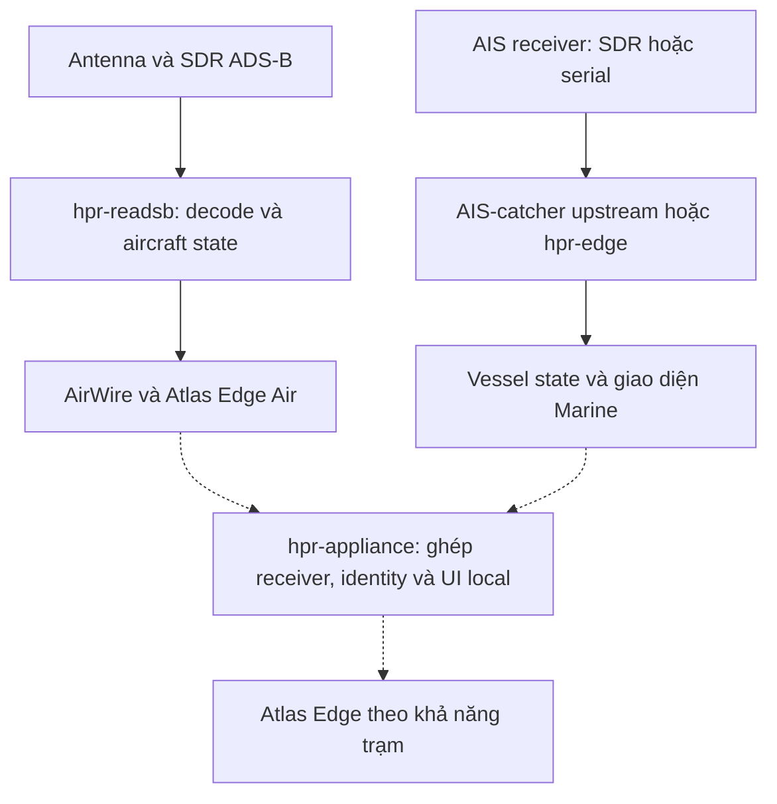
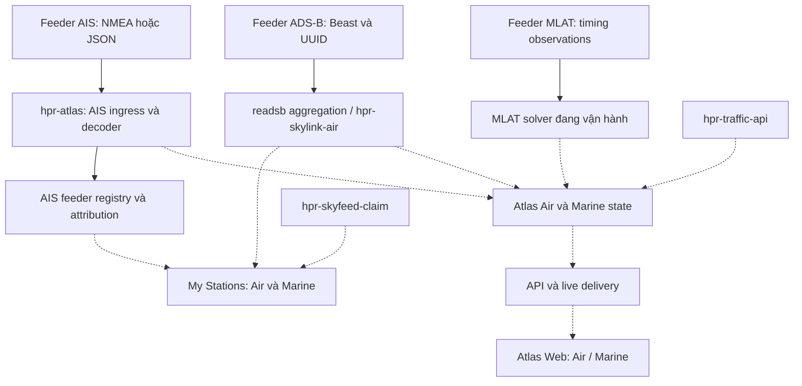
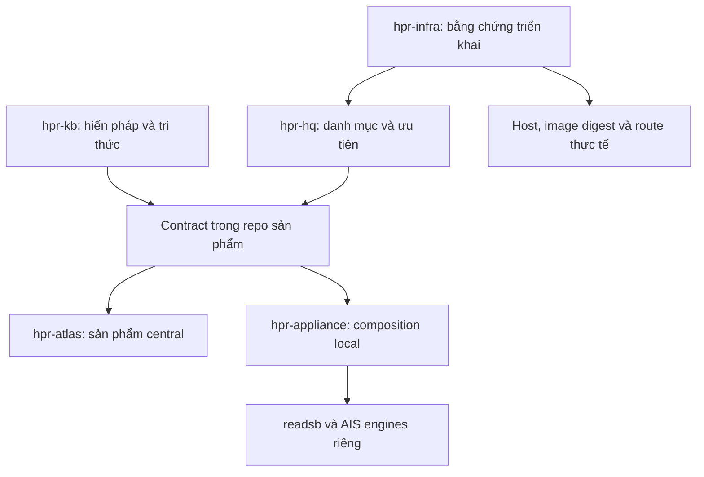

# Hiến pháp kiến trúc HPR

**Revision 0.1 — DRAFT, chờ Thanh phê duyệt qua PR.**

Đây là đầu mối SSOT (Single Source of Truth; “SST” trong hội thoại) cho phạm vi sản phẩm, ranh giới trách nhiệm và nguyên tắc kiến trúc HPR. Không phải báo cáo toàn bộ hệ thống đã triển khai.

Các điều khoản thiết kế dưới đây là **[Inference] đề xuất tổng hợp** từ yêu cầu trong phiên. Phần hiện trạng ghi rõ mức bằng chứng. Chỉ bản trên nhánh mặc định sau khi PR được duyệt mới có hiệu lực; bản tải về, bản tóm tắt và chat không tạo thêm nguồn chuẩn.

## 1. Intent — HPR làm gì

HPR xây mạng thu nhận và sử dụng dữ liệu quan sát, bắt đầu từ **Air + Marine**. Atlas là trải nghiệm sản phẩm; mạng feeder là một phần sản phẩm, không chỉ là nguồn đầu vào.

Ưu tiên hiện tại: một chủ trạm có thể đưa nguồn thu lên HPR, biết local đang thu gì, central đã nhận gì, quản lý trạm và quyền riêng tư bằng ngôn ngữ dễ hiểu.

Nghiên cứu RF rộng hơn nằm trong RF Portfolio. Remote ID, radiosonde, passive radar và các họ khác không tự trở thành backlog hoặc yêu cầu schema hôm nay.

## 2. SSOT và thẩm quyền

| Câu hỏi | Nguồn chuẩn |
|---|---|
| HPR có phạm vi và nguyên tắc kiến trúc nào? | Tài liệu này trong hpr-kb |
| Contract trường dữ liệu/API/wire chính xác là gì? | Contract có version và test trong repo sở hữu implementation; hiến pháp dẫn tới đó |
| Repo nào chịu trách nhiệm gì? | Ranh giới tại đây; danh mục đầy đủ trong hpr-hq |
| Hiện chạy image nào, trên host nào? | Bằng chứng triển khai có thời gian và digest từ hpr-infra |
| Việc nào được ưu tiên, ai làm? | hpr-hq và issue/PR của repo thực hiện |
| Nguồn RF mới có đáng đầu tư? | RF Portfolio trong hpr-kb; giữ nhãn nghiên cứu |

Một đầu mối kiến trúc không có nghĩa một file chứa mọi thông số hoặc một database chứa mọi dữ liệu. SSOT không thay thế code hay bằng chứng runtime.

Khi code khác thiết kế: ghi thành khoảng cách cần giải quyết. Không sửa báo cáo thực tế để trông như tuân thủ. Chat mới có quyết định khác phải được phản ánh vào PR trước khi các repo nhận chỉ dẫn trái nhau.

## 3. Kiến trúc đối chiếu tài sản hiện có

### 3.1 BR1 — antenna tới trải nghiệm local

Sơ đồ trách nhiệm theo tài liệu repo, **không phải xác nhận mọi đường nối đã chạy**. Đường liền là đường thành phần được mô tả/đọc; đường chấm là tích hợp mục tiêu.

- hpr-readsb đã có implementation và tài liệu AirWire/Edge; chưa chứng nhận toàn bộ wire/runtime parity trong đợt review này.
- hpr-edge là AIS serial node có sẵn; không đồng nhất với readsb Edge.
- hpr-appliance tự ghi trạng thái architecture/scaffold. Không coi là image production.
- hpr-ais-catcher được appliance nêu là kế hoạch; truy cập repo trong đợt kiểm tra trả 404. Không kết luận repo không tồn tại, cũng không ghi là donor đã sẵn sàng.

### 3.2 BR2 — feeders tới central và UI

Các đường vào Atlas chung là mục tiêu tích hợp. Cổng ingest MLAT nhận timing observations; vị trí đã giải là một đầu ra khác.

- ADS-B/MLAT hoạt động ổn là thông tin Thanh cung cấp; không phải runtime test mới.
- Đường AIS trong main đã đọc có registry IP và credit trước dedup.
- Registry UUID nằm trên nhánh riêng; relay TAG và server HPR1 chưa đồng bộ.
- My Stations thống nhất và mọi mũi tên chấm chưa được coi là end-to-end PASS.
- Enrichment không được chặn đường live. Lịch sử ghi bất đồng bộ theo chính sách lưu; chưa áp đặt database mới.

### 3.3 Quan hệ quản trị và sản phẩm

Đây là quan hệ trách nhiệm, không phải bảy service mới.

## 4. Bản đồ repo và mức bằng chứng

Ngày review: 2026-09-20. “Mã đã đọc” không đồng nghĩa đã build, đã deploy hay đạt tải.

| Repo / tài sản | Vai trò | Bằng chứng / giới hạn |
|---|---|---|
| hpr-atlas | Central ingest, state, API/live delivery, UI | main e039281; đã đọc AIS ingress, registry, decoder, binary hub |
| hpr-atlas / agent/feeder-uuid-claim | AIS UUID registry, migration, admin claim | 3952a7f; đã đọc implementation và tests; chưa chạy tests |
| hpr-readsb | Aviation receiver/state và local Air UI | README trên dev đã đọc; giữ RF/CPR core upstream |
| hpr-skylink-air | Đóng gói aviation central + attribution API | README đã đọc; composition runtime chưa kiểm thử |
| hpr-skyfeed-claim | Client hỗ trợ claim ADS-B | README đã đọc; chưa chứng nhận server ownership binding |
| hpr-edge | AIS serial node và Marine local UI | README đã đọc |
| hpr-marine | Marine UI, nguồn donor interaction/rendering | README hiện tại + scout trước; không coi là UI chuẩn thứ hai |
| hpr-appliance | Ghép nhiều receiver tại một site | abe8834; README xác nhận scaffold |
| hpr-traffic-api | Identity/catalog/route enrichment | README đã đọc; benchmark README không dùng làm kết quả HPR hiện tại |
| MLAT service | Solver chuyên dụng | Thanh báo đang vận hành; repo/image production chưa xác định trong review |
| AIS-catcher upstream | AIS reception/decoder donor | Thành phần upstream; không phải mã do HPR tự viết |
| hpr-ais-feed pilot | Relay station gắn TAG UUID | Source package local 0.1.0; chưa build image, chưa có repo chuẩn được chỉ định |
| hpr-hq | Portfolio, ưu tiên, repo inventory | README hiện tại |
| hpr-infra | Quan sát host/workload/routes/deployment | README hiện tại; chưa có scan production mới |
| hpr-kb | Tri thức và SSOT kiến trúc | Base ce45c298 |

Donor bổ sung từng được scout: airspace, aircraft-assets, streamgrid-runtime, hpradar-meteo. Chỉ dùng sau khi pin branch/commit, đọc license, kiểm thử phần lấy. Không chuyển nhãn “donor” thành “production” bằng tên repo.

## 5. Điều khoản kiến trúc

### A. UNIFY trải nghiệm, giữ domain

1. Air và Marine chung cách điều hướng, tài khoản, trạm, quyền và cách biểu đạt trạng thái.
2. Giữ readsb, AIS decoder và MLAT solver chuyên biệt. Không ghép decoder chỉ để có một core.
3. Core tối thiểu giữ identity, timestamp, provenance, validity và quyền truy cập. Trường chuyên ngành ở domain.
4. C0–C7 là bản đồ trách nhiệm tư duy, không bắt buộc tám service, tám database hoặc đủ tám bước.
5. Thêm domain có thể cần schema/contract mới khi ý nghĩa thực sự khác. Không ép vào generic key-value hay một struct chứa mọi trường.
6. Việc đổi C/Go, JSON/binary, framework hay database cần lý do kỹ thuật và số đo. Hiến pháp không khóa ngôn ngữ hoặc byte layout vĩnh viễn.

### B. Dữ liệu đúng nghĩa

1. Máy bay khác chuyến bay; tàu khác hành trình. AtoN không phải vessel chỉ vì cùng AIS.
2. MLAT là phương pháp tính vị trí của aircraft, không phải entity class mới.
3. UUID/ICAO24/MMSI có namespace và ý nghĩa riêng; non-ICAO phải giữ phân biệt.
4. Không biến missing thành zero; metadata mới không làm vị trí cũ thành live.
5. Giữ khác biệt observed/received/updated time; không có thời gian RF thì ghi unknown.
6. Ground speed, airspeed, course, heading, vertical rate và ROT không thay thế lẫn nhau.
7. Quality giữ đúng loại và đơn vị; không tạo điểm confidence chung không có định nghĩa.
8. Enrichment không ghi đè dữ liệu thu mà mất provenance.
9. “Hot” là cách vận chuyển/cập nhật, không phải nguồn gốc hoặc ý nghĩa dữ liệu.
10. Giữ nguồn gốc tới mức upstream thực sự cung cấp. Không tạo observation refs/receiver participation giả khi upstream không có.
11. Bảo toàn evidence không đồng nghĩa lưu mọi raw message vô hạn; retention có giới hạn, ngân sách và mục đích.

### C. Station, receiver và source

| Thuật ngữ nội bộ | Nghĩa | Tên hiển thị |
|---|---|---|
| site | Địa điểm lắp đặt | Địa điểm |
| station | Nhóm vận hành người dùng quản lý tại một địa điểm | Trạm của tôi |
| receiver | Bộ thu hoặc receiver instance logic | Bộ thu ADS-B / Bộ thu AIS |
| source | Đầu vào có nguồn gốc được biết; có thể là aggregate | Nguồn dữ liệu |
| connection | Phiên kết nối/UDP flow tạm thời | Kết nối |
| service | Tiến trình/container thực thi | Chỉ trong chẩn đoán |
| entity | Khái niệm nội bộ | Máy bay / tàu / báo hiệu hàng hải |
| provenance | Cách biết giá trị đó | Nguồn, phương pháp |
| ownership | Quyền quản lý được xác minh | Quyền quản lý trạm |

V1 không bắt buộc site và station thành hai bảng; có thể dùng một record cho một trạm tại một địa điểm. Receiver UUID hiện có tiếp tục định danh receiver; nhiều receiver được liên kết vào station. Trường lịch sử mang tên station_uuid phải có mapping rõ trước khi đổi nghĩa.

Nhận packet từ IP không chứng minh một trạm riêng. Aggregate không có attribution không được suy ra thành hàng nghìn receiver đã xác minh.

### D. Giao diện theo vai trò

| Vai trò | Tác vụ ưu tiên |
|---|---|
| Người xem | Tìm, chọn, theo dõi aircraft/vessel, xem tuổi và nguồn vị trí |
| Chủ trạm | Xem local thu được gì, HPR nhận gì, claim và privacy |
| Admin | Xử lý attribution, nguồn lỗi, quyền, xung đột và deployment |

V4.7 là baseline thị giác theo hướng gần đây của Thanh; donor runtime có thể khác. UI không hiển thị C0–C7, ontology, canonical fact hoặc fanout. Giữ thuật ngữ domain chính xác như MLAT, squawk, SOG, COG.

“Bộ thu hoạt động”, “đang gửi”, “HPR đã nhận” là ba trạng thái độc lập. Mỗi nhãn có nguồn bằng chứng; không lấy successful UDP write làm xác nhận central.

### E. Privacy và quyền

1. UUID là identifier, không phải password.
2. Public DTO được tạo bằng danh sách trường được phép; không serialize registry nội bộ.
3. IP, UUID đầy đủ, exact location và liên kết station–object không công khai mặc định.
4. Claim và consent công khai là hai quyết định riêng.
5. Public station dùng public_id độc lập. API chủ trạm kiểm tra ownership phía server.
6. Gỡ identity nội bộ khỏi public raw fanout; sửa UI đơn thuần không đủ.
7. UDP checksum không cung cấp xác thực hay bảo mật đường truyền. Ghi transport limitation; nâng lên đường mã hóa khi yêu cầu cần.
8. Log/retention có mục đích và thời hạn. Không đưa secret vào repo hoặc telemetry công khai.

Đây là chính sách thiết kế, không phải xác nhận privacy hiện tại đã đạt.

### F. Phát hành và vận hành

1. CI build/test image; station và production pull image theo SHA/digest. Station không là build server.
2. Runtime có giới hạn tài nguyên, log xoay vòng, state volume, restart policy và rollback.
3. Không dùng privileged, Docker socket hoặc mount host rộng cho relay. Device access chỉ cấp cho decoder cần thiết.
4. Reboot recovery cần thử thực tế, gồm Docker startup và identity persistence.
5. Phân biệt source review, unit test, integration, physical test, soak và production verification.
6. Không tuyên bố vượt đối thủ, FPS, CCU hoặc mức tiết kiệm nếu thiếu workload, máy đo, phương pháp và kết quả.
7. Pilot relay 0.1.0 đã giao là ngoại lệ chưa hoàn tất: source-build, chưa có image. Không làm mẫu onboarding lâu dài.

## 6. Bảng dữ liệu Air + Marine v1

Bảng phân loại phục vụ thiết kế; không buộc mọi domain có mọi trường.

| Nhóm | Air | Marine | Nguồn / cách xử lý |
|---|---|---|---|
| Identity | ICAO24/non-ICAO, callsign | MMSI, callsign, ship name, IMO khi có | Giữ transmitted và registry riêng |
| Classification | Emitter category; type từ registry | Ship type; AtoN/base theo loại đối tượng | Không gộp category với protocol |
| Position | ADS-B decoded hoặc MLAT solved | AIS lat/lon | Source method + tuổi vị trí |
| Altitude | Barometric/geometric, reference rõ | Không áp dụng cho vessel thông thường | Domain-specific |
| Speed | GS riêng IAS/TAS | SOG | Đơn vị và loại tốc độ rõ |
| Direction | Track; true/magnetic heading | COG; true heading | Không đồng nhất course và heading |
| Rates | Vertical rate; track rate nếu có | ROT | Các trường độc lập |
| Status | Squawk, emergency, air/ground | Navigation status | Theo field và validity |
| Declaration | Intent nếu nguồn cung cấp | Destination/ETA/draught | Không coi là hành trình đã xác minh |
| Reception quality | RSSI và số liệu receiver | RSSI/channel khi có | Metadata thu |
| Position quality | NIC/NAC/SIL hoặc solver quality | Accuracy flag và thông tin liên quan | Không trộn với RSSI |
| Receiver/source | UUID hoặc upstream source đã biết | UUID hoặc legacy/aggregate | Attribution riêng với ownership |
| Runtime age | Last received và last position update | Tương tự | Tính từ timestamp có nghĩa rõ |
| Enrichment | Registration/model/operator/photo | Registry/builder/operator/photo | Cache, không chặn live |
| Context | Route/schedule/weather | Port/voyage/weather | Phân biệt khai báo, tính toán và bên ngoài |

Contract triển khai phải ghi field, units, missing value, timestamp, source, quyền và ví dụ/test vector. Không sao chép toàn bộ wire specification vào hiến pháp.

## 7. Khoảng cách hiện tại và thứ tự xử lý

| Ưu tiên | Khoảng cách đã thấy | Nơi xử lý | Điều kiện đóng |
|---|---|---|---|
| P0 | Relay TAG khác server HPR1 | Relay + hpr-atlas identity/ingress | Chốt contract, test tagged/HPR1/legacy, cùng NAT, đổi IP |
| P0 | Public/API có đường trả IP trong mã đã đọc | hpr-atlas feeders.go + routing | Test public/admin/owner; kiểm raw fanout |
| P0 | Fragment key thiếu source; extractMMSI chưa guard fragment tiếp | decode.go, main.go, ws2.go | Interleaved-source và multipart tests; attribution đúng |
| P0 | Pilot chưa build image | CI của repo relay được chỉ định | Image ARM target + digest; pull/run trên station |
| P1 | Registry UUID ở nhánh riêng | agent/feeder-uuid-claim | Review migration và merge có test; xác minh digest đang chạy |
| P1 | Chưa có My Stations Air/Marine end-to-end | Atlas + các API có sẵn | Local/central state, ownership và privacy hoạt động |
| P1 | KB có chỉ dẫn baseline/core cũ | hpr-kb | PR hiến pháp và liên kết supersession được duyệt |
| P2 | Appliance mới scaffold | hpr-appliance | Một site nhiều receiver, local UI và restart thực tế |
| Deferred | RF mới, 3D mở rộng, phân tán lớn | RF Portfolio / repo liên quan | Use case và benchmark riêng trước đầu tư |

Phương án TAG theo từng câu là đề xuất cho attribution độc lập packet; HPR1 đã có implementation. Quyết định transport cuối phải nằm trong PR implementation, không coi bảng này là test tương thích.

## 8. Quy trình thay đổi hiến pháp

- Thanh là người phê duyệt phạm vi và các thay đổi kiến trúc lâu dài.
- Đề xuất qua PR vào đúng file này: vấn đề, điều khoản đổi, tác động lên repo/contract, bằng chứng và migration.
- Revision chỉ tăng khi nội dung được cập nhật; ghi ngày, người duyệt và PR trong Evolution.
- Dẫn link từ README các repo; không copy một bản “hiến pháp riêng” vào từng repo.
- Quyết định mức byte/field ở contract repo; quyết định thay ranh giới hoặc semantics chung phải cập nhật tài liệu này.
- Bản DRAFT chưa thay thế chính sách nhánh mặc định. Khi duyệt, xử lý đồng thời các mục xung đột đã liệt kê.

## 9. Supersession dự kiến

| Nội dung cũ | Cách hiểu mới khi revision được duyệt |
|---|---|
| hpr-atlas KB chọn V4.8 làm baseline | Hướng gần đây chọn V4.7 visual; không suy ra runtime donor hoặc commit deploy |
| New protocol không được đổi schema/taxonomy | Tận dụng phần chung; cho phép domain/schema mở rộng khi nghĩa khác |
| Giữ mọi candidate/evidence | Giữ provenance cần thiết trong retention có giới hạn; không hứa lưu vô hạn |
| Universal UI theo core | UI theo domain và vai trò; core vocabulary nội bộ |
| Pilot build source trên feeder | CI build image, station pull; pilot cũ chưa đạt chuẩn onboarding |

Các tài liệu cũ giữ nguyên như lịch sử; notice ở đầu chỉ rõ có đề xuất thay thế. Không xóa các quyết định không liên quan.

## 10. Sources và giới hạn bằng chứng

- Phiên Unify HPR hiện tại, tới yêu cầu sơ đồ/SSOT: source_status=session-derived; raw_available=false trong repo.
- [Phiên chia sẻ Continue Atlas Parity](https://chatgpt.com/share/6aaf5cad-9ff8-83ec-9131-04ee791fa2ae): đã đọc; các báo cáo implementation lịch sử chưa tái kiểm chứng.
- [Atlas main e039281](https://github.com/hpradarhq/hpr-atlas/tree/e039281de231f9a62eb4c88d20fc3f688cc79029): main.go, feeders.go, decode.go, ws2.go, internal/ingest/ingest.go.
- [AIS UUID 3952a7f](https://github.com/hpradarhq/hpr-atlas/tree/3952a7f73a24520b027c748e5ea7c3442872c70c): hpr_identity.go, hpr_identity_test.go, feeders.go, main.go, docs/FEEDER_CLAIM_SOP.md.
- [Appliance abe8834](https://github.com/hpradarhq/hpr-appliance/tree/abe8834c4a82e0fde399b18e0f1bf489ca013f8a).
- [Observation Core tại KB base](https://github.com/hpradarhq/hpr-kb/blob/ce45c298444f872e20999043945f1ea632378f4d/kb/streams/hpr-observation-core.md).
- README đọc 2026-09-20: [readsb](https://github.com/hpradarhq/hpr-readsb/blob/dev/README.md), [skylink-air](https://github.com/hpradarhq/hpr-skylink-air/blob/main/README.md), [claim agent](https://github.com/hpradarhq/hpr-skyfeed-claim/blob/main/README.md), [edge](https://github.com/hpradarhq/hpr-edge/blob/main/README.md), [marine](https://github.com/hpradarhq/hpr-marine/blob/main/README.md), [traffic API](https://github.com/hpradarhq/hpr-traffic-api/blob/master/README.md), [HQ](https://github.com/hpradarhq/hpr-hq/blob/main/README.md), [Infra](https://github.com/hpradarhq/hpr-infra/blob/main/README.md). Các link nhánh có thể thay đổi; không coi là pin deployment.
- [readsb field semantics](https://github.com/wiedehopf/readsb/blob/dev/README-json.md), [AIS field reference](https://gpsd.gitlab.io/gpsd/AIVDM.html): đã đối chiếu ở phiên này; không thay thế specification đầy đủ.

Không có production scan, benchmark mới, container runtime test hoặc xác nhận đã đóng BR2 trong tài liệu này.

## 11. Evolution

- 2026-09-20 — revision 0.1 DRAFT: tổng hợp tài sản hiện có, BR1/BR2, ranh giới core/domain/UI, privacy và release gates. Chờ review; chưa merge/deploy.
